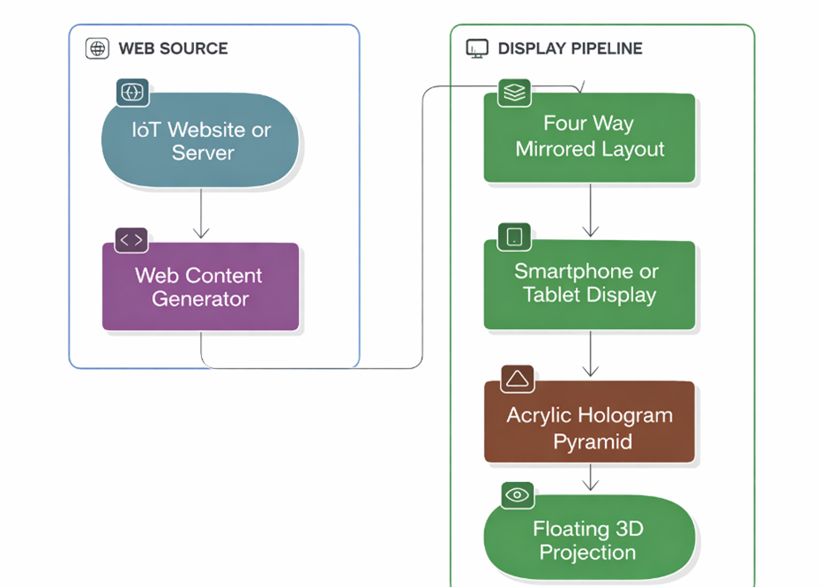
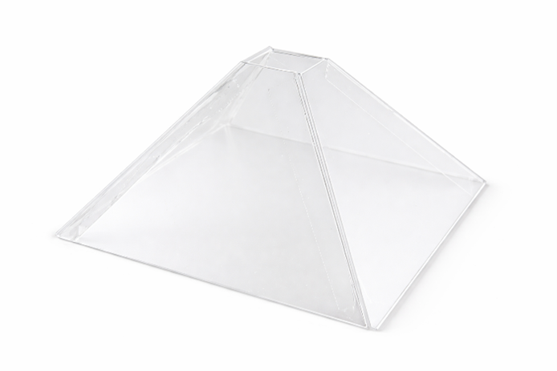
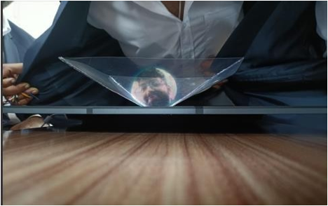
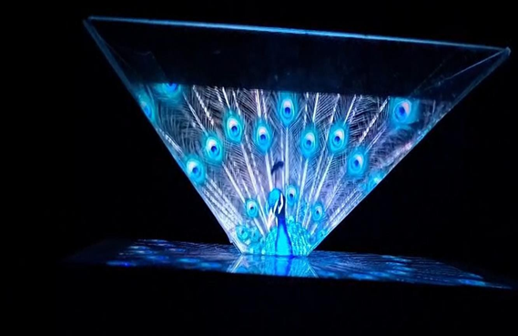
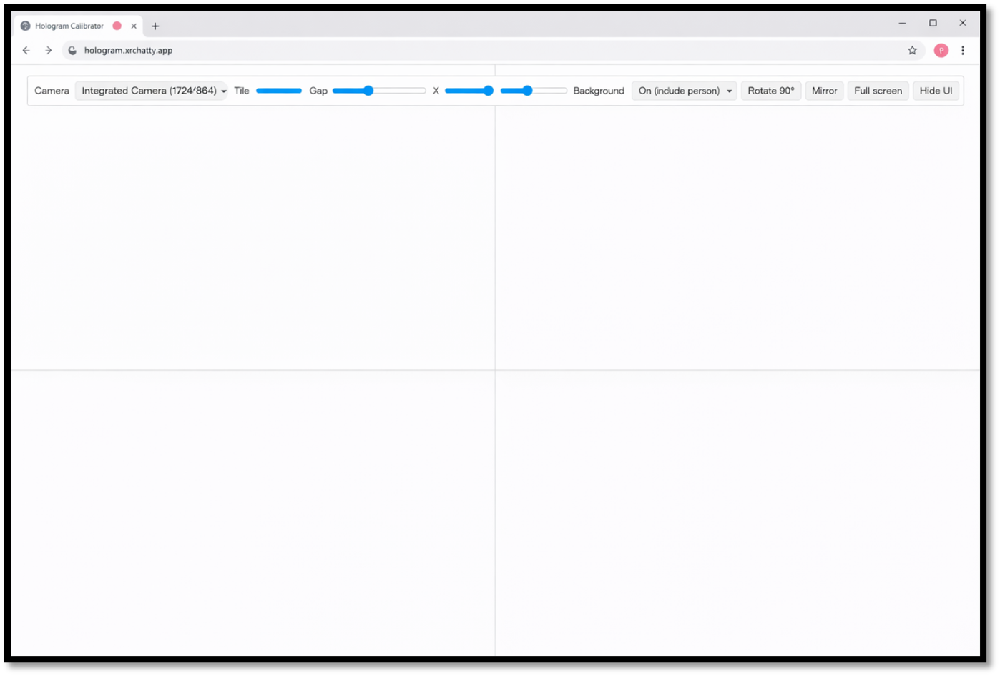

# Hologram View – Camera Based Web Application

## Description
This project demonstrates a **real-time hologram visualization system** using a device camera.
The application mirrors and tiles the live video feed to simulate a **holographic display effect**,
which can be viewed using a hologram pyramid.

This project is developed as a **college mini project** and focuses on real-time visualization
using modern web technologies.

---

## Live Demo
🔗 https://hologramview.netlify.app/

---

## Technologies Used
- HTML5
- CSS3
- JavaScript
- Web Camera API
- MediaPipe (via CDN)
- Netlify (Deployment)

---

## How to Run
1. Clone or download the repository  
2. Open `index.html` in a modern web browser  
3. Allow camera access when prompted  
4. Adjust the on-screen view to align with the hologram pyramid  

---

## System Block Diagram
The following block diagram shows the overall working of the system.

---

## Hardware Setup – Hologram Pyramid
A transparent hologram pyramid is placed over the display to visualize the holographic output.

---

## Project Output

### Live Hologram Visualization
The camera feed is mirrored and tiled to create a hologram-like visual effect.

---

## Web Interface
The web-based interface provides live camera access and hologram visualization.

---

## Project Type
College Mini Project

---

## Project Team
- **Likhith Gowda H R**
- **Akash V**
- **Kushal B**

---

## Project Report
The complete mini project documentation is available in the report file included in this repository.

---

## License
This project is developed **for academic and educational purposes only**.
